# React Performance Optimization

### **What We Used**
1. **`useMemo`:** Memoized the filtered, searched, and sorted lists of countries.
2. **`useCallback`:** Memoized functions used for filtering, searching, and sorting, to prevent their recreation on every render.
3. **`React.memo`:** Prevented unnecessary re-renders of country cards.
4. **`key`:** Ensure proper use of key props for lists to avoid reconciliation issues.

### **Before Optimization:**

- **Country Name Search:**
    - **Commit Duration:** **2.5 sec**
    - **Render Duration:** **2.6 sec**
    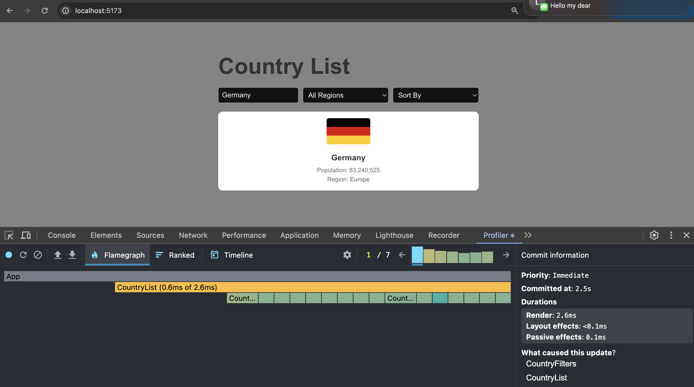
    - **Interactions:**
    - Every time the user typed a letter in the search input, all country cards re-rendered, making the search feel slow.
    - **Flame Graph:**
    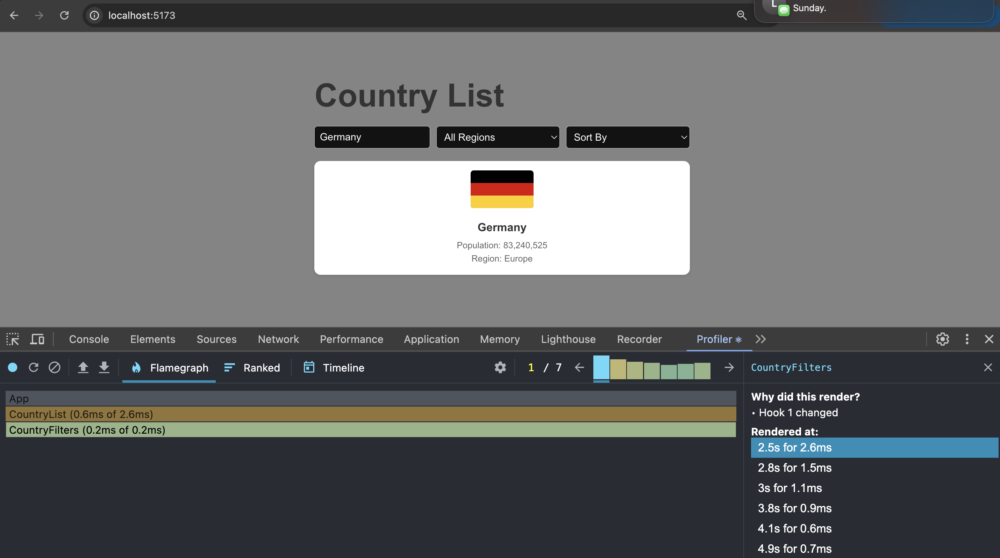
    - **Ranked Chart:**
    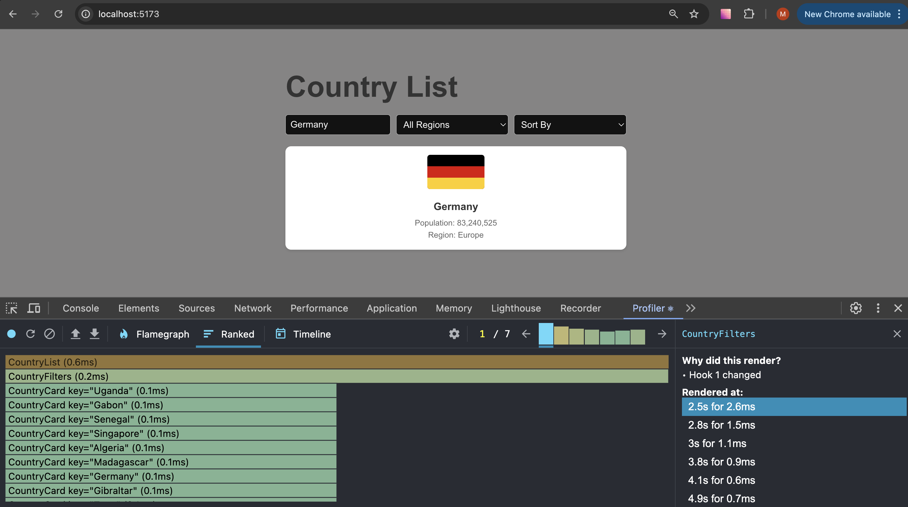

- **Filter Countries by Region:**
    - **Commit Duration:** **2.5 sec**
    - **Render Duration:** **3.4 sec**
    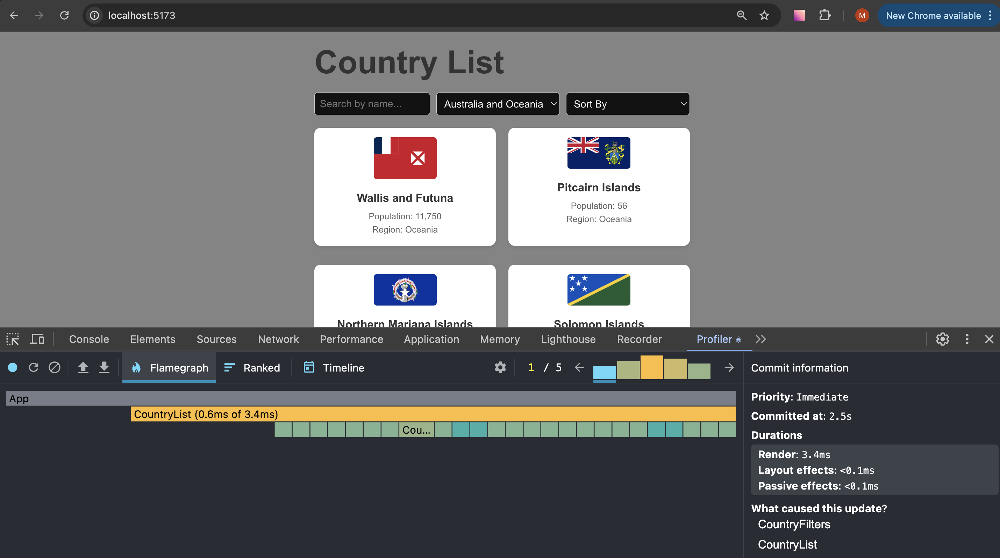
    - **Interactions:**
    - Changing the region filter caused all countries to re-render, even when only a subset of countries was affected.
    - **Flame Graph:**
    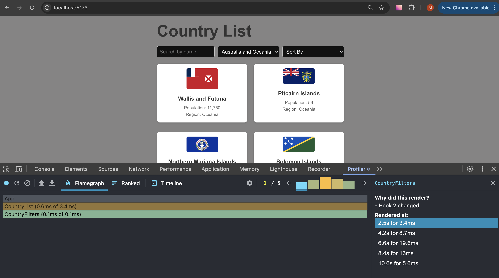
    - **Ranked Chart:**
    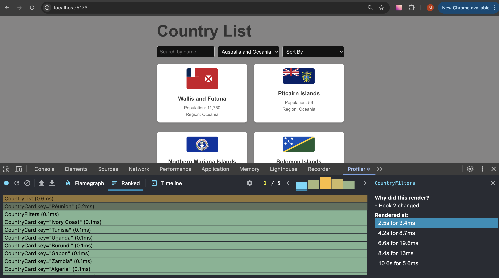

- **Sorting Countries by Name and Population:**
    - **Commit Duration:** **2.8 sec**
    - **Render Duration:** **11.9 sec**
    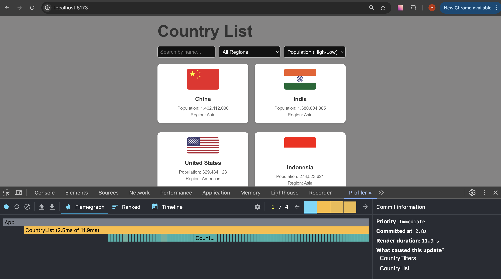
    - **Interactions:**
    - Every time the user changed the sort order or type of sorting, all country cards re-rendered.
    - **Flame Graph:**
    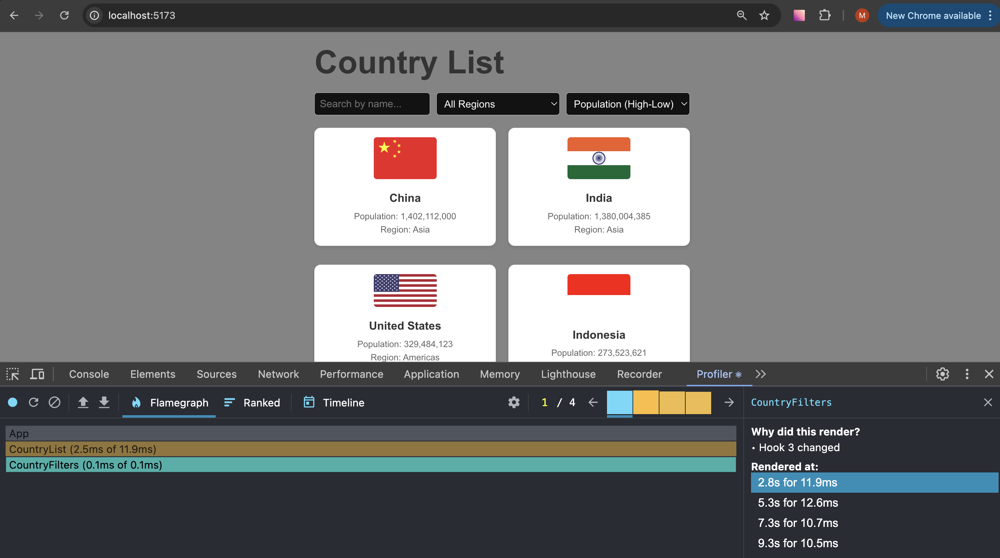
    - **Ranked Chart:**
    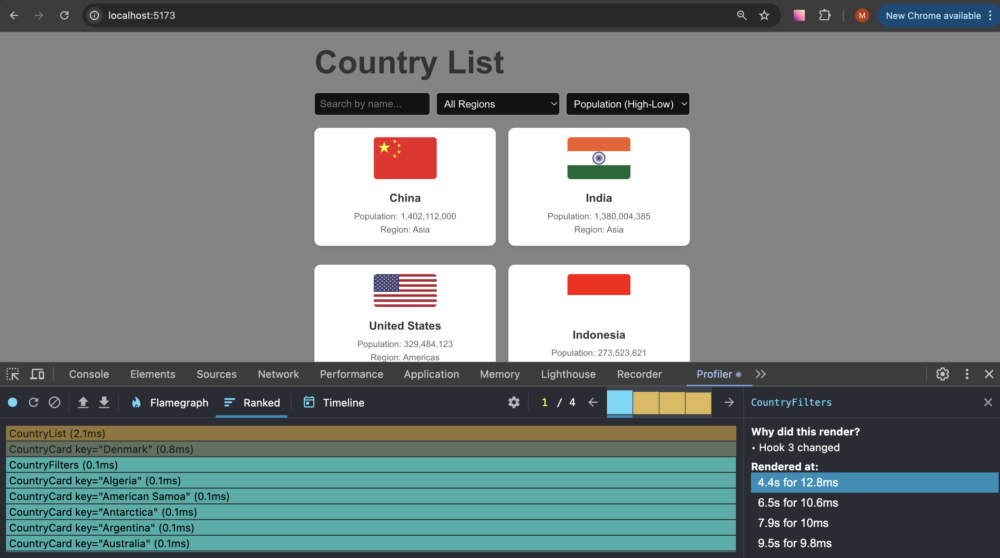

### After Optimization:

- **Country Name Search:**
    - **Commit Duration:** **2.6 sec**
    - **Render Duration:** **1.9 sec**  - 27% faster!!!!
    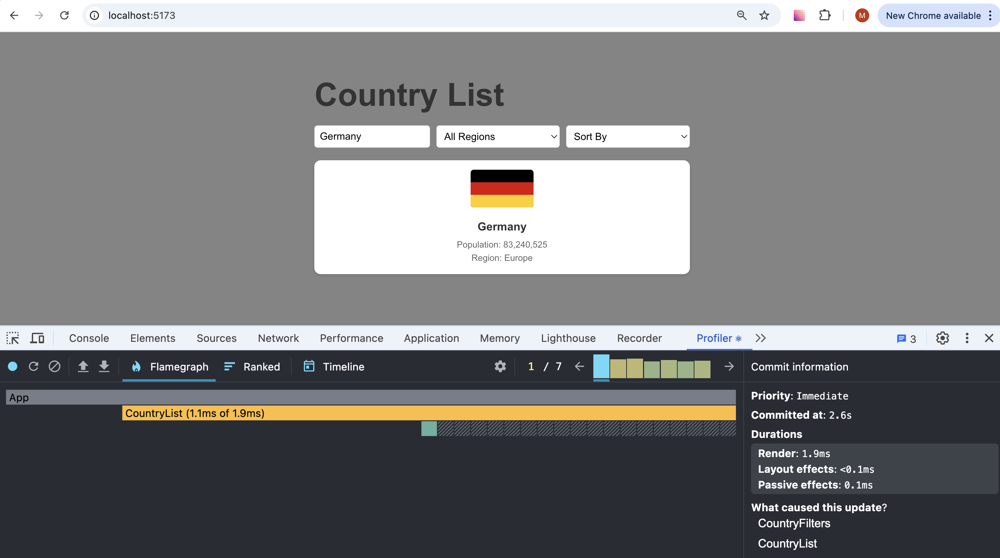
    - **Interactions:**
    - Now, only the countries that match the search are updated when the user types, making the search faster.
    - **Flame Graph:**
    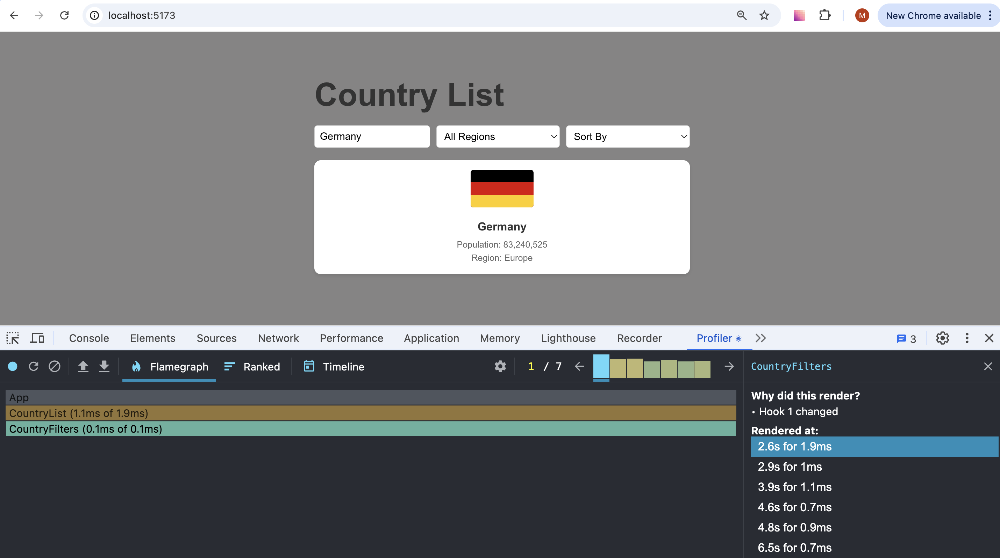
    - **Ranked Chart:**
    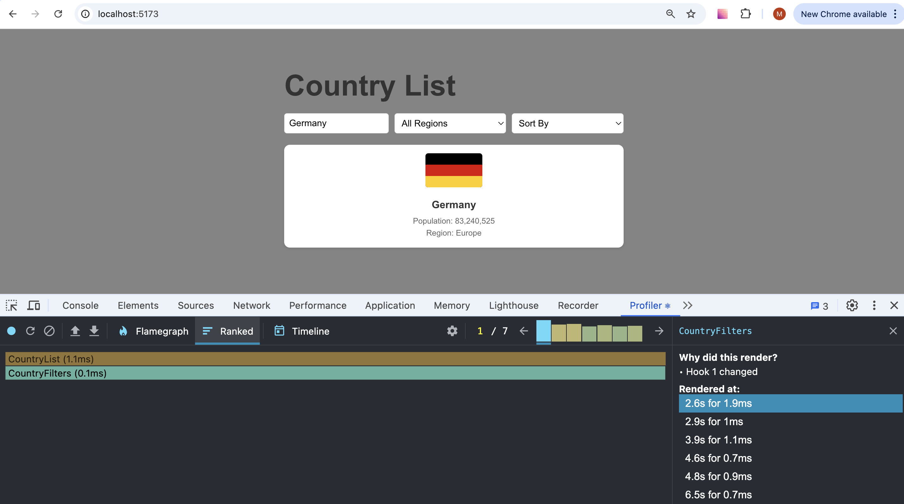

- **Filter Countries by Region:**
    - **Commit Duration:** **2.9 sec**
    - **Render Duration:** **1.8 sec** - 47% faster!!!!
    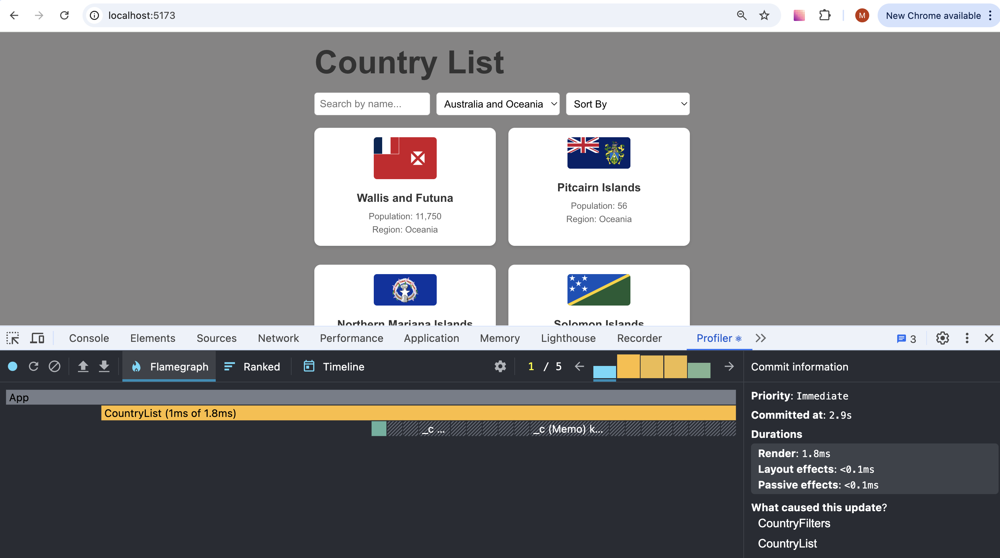
    - **Interactions:**
    - Now only the countries matching the selected region re-render when the filter is changed.
    - **Flame Graph:**
    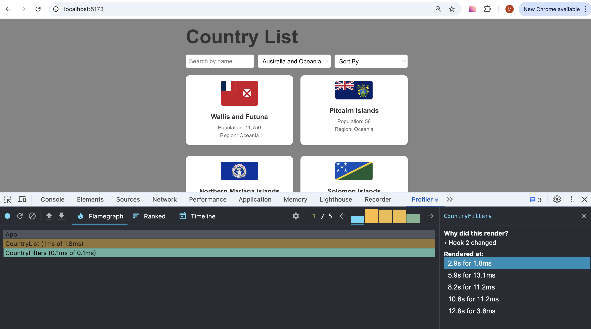
    - **Ranked Chart:**
    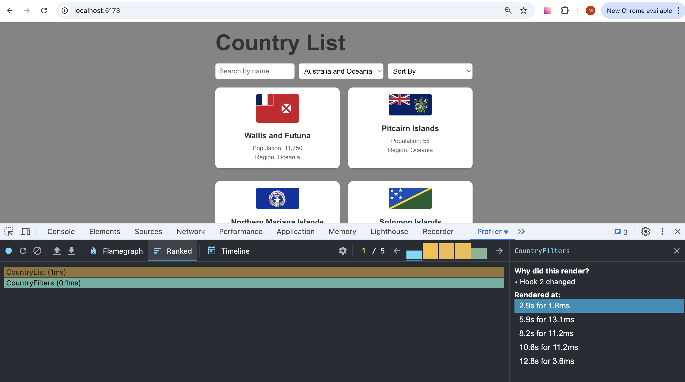

- **Sorting Countries by Name and Population:**
    - **Commit Duration:** **3.1 sec**
    - **Render Duration:** **4.1 sec** - 66% faster!!!!
    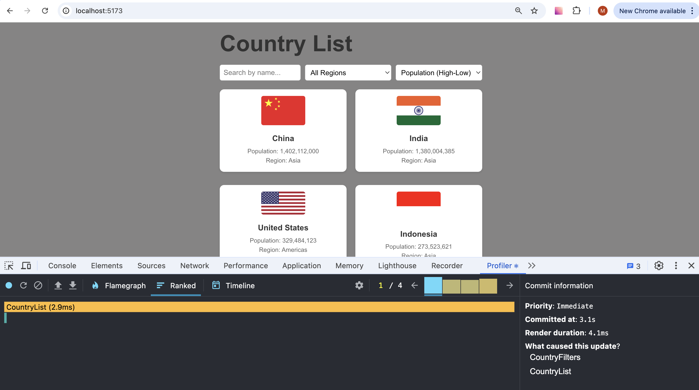
    - **Interactions:**
    - Now sorting triggers re-renders only for the sorted countries, making render much more faster.
    - **Flame Graph:**
    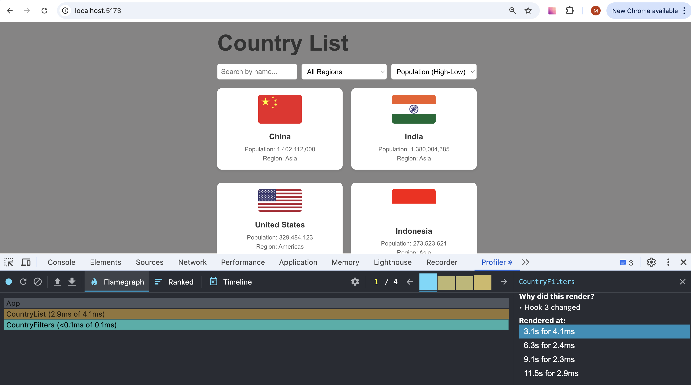
    - **Ranked Chart:**
    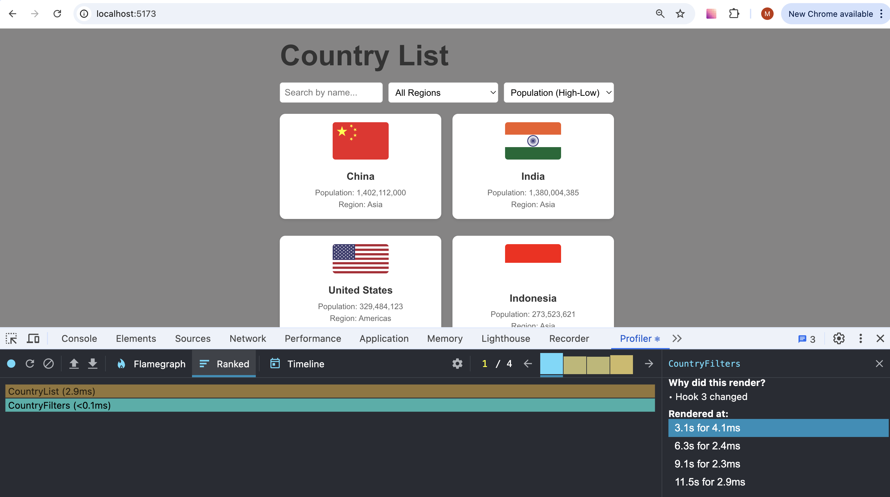

## Summary:
- **Country Name Search**: Reduced render time by **27%**.
- **Filter Countries by Region**: Improved render time by **47%**.
- **Sorting Countries by Name and Population**: Improved render time by **66%**.
